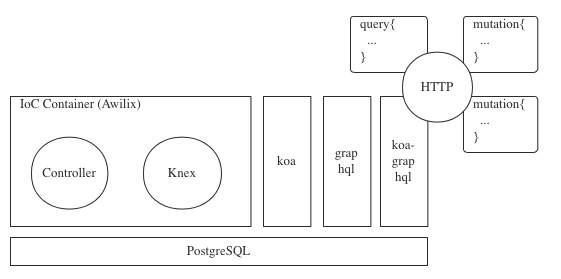

# bookstore-apiserver

A typical Web API example project for learning through graphql, awilix, koa and knex across NodeJS techstacks



## Dependencies

```shell
npm i --save graphql awilix knex pg
npm i --save koa @koa/router koa-graphql
```

## Migrations & Startup

```shell
cd src/
npx knex migrate:latest
npx knex seed:run
npm start dev
```

## CRUD

- Query a book list

```graphql
query {
  getBooks {
    id
    title
    author
    price
  }
}
```

- Create a book

```graphql
mutation{
  createBook(input: {
    title: "The Road to React",
    author: "Robin Wieruch",
    price: 55.5,
  }){
    title
  }
}
```

- Update a book

```graphql
mutation{
  updateBook(id: 1,input: {
    title: "How to Lead in Data Science",
    author: "Dr. Jike Chong and Yue Cathy Chang",
    price: 105.5,
  }){
    title
    author
    price
  }
}
```

- Delete a book

```graphql
mutation{
   deleteBook(id: 4) 
}
```

# Miscellaneous

- Create a migration file - `npx knex migrate:make create_book_table`
- Create a seed file - `npx knex seed:make seed_books`

